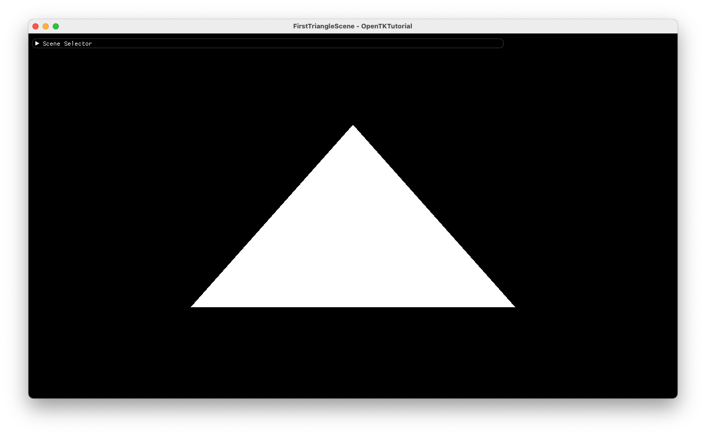

# OpenTKTutorial

This is my hobby project for understanding about OpenTK & OpenGL.

# ScreenShot

## Basic

### 01. First Triangle

Display a triangle.

### 02. Colored Triangle

Display a triangle with colored vertices.

### 03. Uniform Variable

Using shader uniform variables.

### 04. IBO (Index Buffer Object)

Display a rectangle with IBO.

### 05. Transformations

Object Transformations & Camera.

